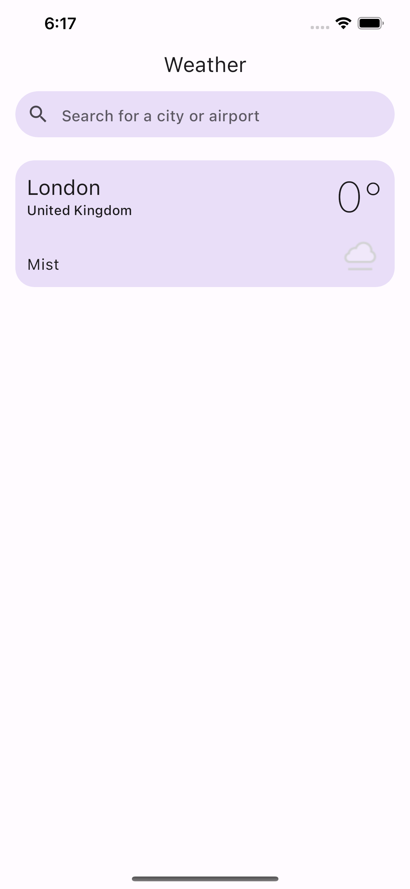
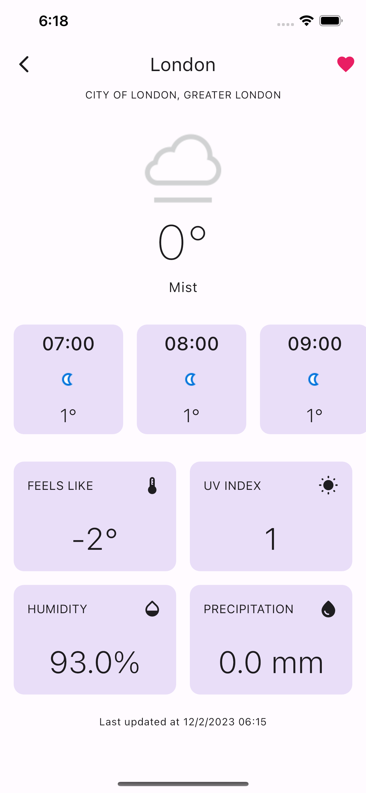

# weather_app

A new weather app.

## Introduction

An simple weather app using https://api.weatherapi.com.
With weather app, you can:

- Search for a place by using city name, US Zipcode, UK Postcode, Canada Postalcode, IP address, Latitude/Longitude
- View realtime weather, and weather forecast for next hours.
- Favorite some places to view later

## Getting Started

- To run the app, you need flutter 3.16.1 or above.
- Run ``flutter pub get``
- Then run ``flutter packages pub run build_runner build --delete-conflicting-outputs`` to generate files.
- ``flutter run --flavor dev`` to start for dev environment (stg for staging and prod for production)

| Screenshots 1                    | Screenshots 2                    |
| -------------------------------- | -------------------------------- |
|  |  |
